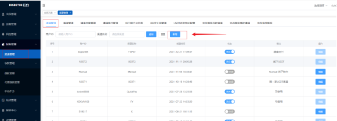
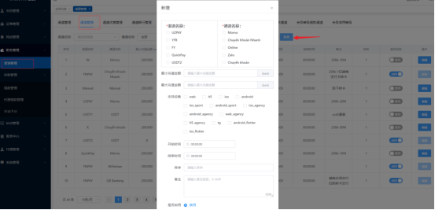
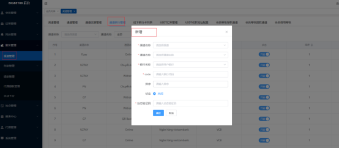

# Finance

有限代财务存提款


#### 一、目前在用支付渠道

1. 风扬支付 缩写fy， 支持代收 代付， 文件：payment_fy_pay.go
2. quick支付，支持代收 代付, 文件：payment_quick_pay.go
3. USDT 支付， 支持代收, 文件：payment_usdt_pay.go
4. UZPay支付，支持代收 代付, 文件：payment_uz_pay.go
5. W支付，支持代收代付，文件：payment_w_pay.go
6. 优付宝支付，支持代收代付， 使用较多，文件：payment_yfb_pay.go
7. 越南支付（众信支付），支持代收代付，主要使用 文件：payment_yn_pay.go
8. 线下转卡，后台配置银行卡收款（较少使用） 后台功能，不在payment模块

#### 二、新增支付渠道步骤

 1. 通过后台财务管理》渠道管理》新增 添加新的渠道
  


 2. 通过后台财务管理》渠道管理》通过管理》新增
 

 3. 如果是三方渠道需要使用online,remit,unionpay支付方式，需要通过后台》财务管理》渠道管理》通道银行管理》新增，（code需要写入三方指定的银行编码标识）
    

    
 4. 在表f_payment中获取刚刚添加的通道id，配置到controller/pay.go中的newestPay map中

#### 三、支付interface结构

```go
package model

import (
"github.com/valyala/fasthttp"
)

// Payment 接口
type Payment interface {
// Name 支付通道名称
Name() string
// New 初始化 通道配置
New()
// Pay 发起支付
Pay(log *paymentTDLog, ch paymentChannel, amount, bid string) (paymentDepositResp, error)
// Withdraw 发起代付
Withdraw(log *paymentTDLog, param WithdrawAutoParam) (paymentWithdrawalRsp, error)
// PayCallBack 支付回调
PayCallBack(ctx *fasthttp.RequestCtx) (paymentCallbackResp, error)
// WithdrawCallBack 代付回调
WithdrawCallBack(*fasthttp.RequestCtx) (paymentCallbackResp, error)
}
```
1. 每个新增的支付渠道只需按照三方文档实现Payment 中的方法即可
2. 配置渠道的代收回调地址， 代付回调地址
3. 回调地址无需权限认证需要在 middleware/jwt.go ->allows中配置新的回调地址
4. 需要运维在lua中配置新地址

#### 四、提款

1. 通过后台财务管理》渠道管理》通过管理》新增 提款通道


2. 提款通道配置好后，只要开启即可在用户发起提款-》风控审核通过后自动分发到相应的通道
